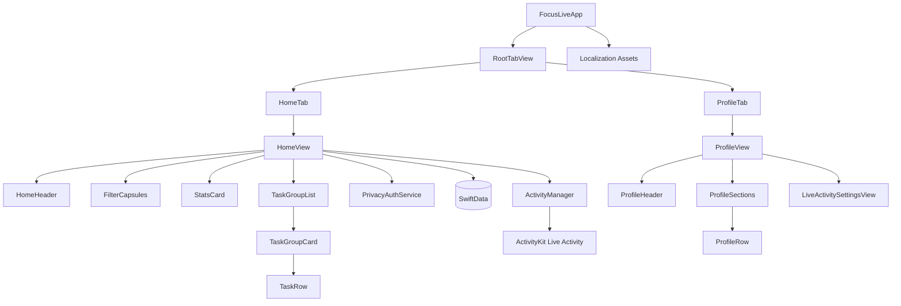
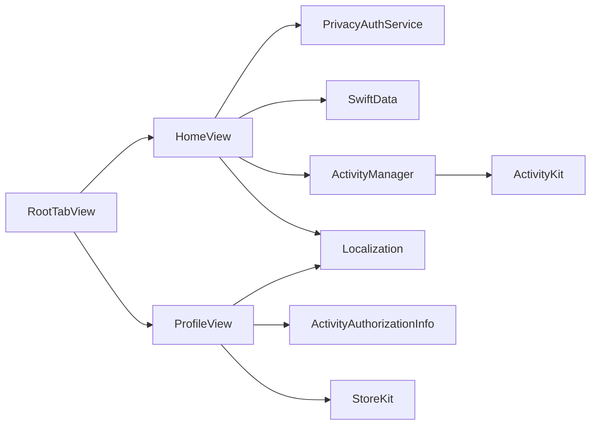
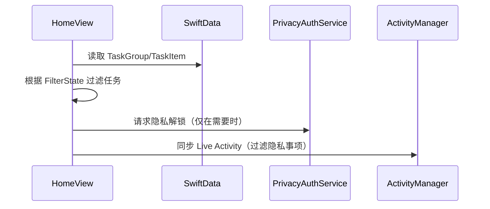

# DESIGN_ui-home-and-profile

> 注：本文为 2026-01-14 阶段性设计记录。当前产品行为已继续演进，默认筛选现为“全部”，锁屏背景改为透明 / 不透明两档，首次启动已升级为交互式新手教程。请以 `README.md`、`CHANGELOG.md` 与 `说明文档.md` 为准。

## 任务信息
- 任务名称：ui-home-and-profile
- 创建日期：2026-01-14
- 阶段：Architect（架构设计）

## 整体架构图（Mermaid）

## 分层设计与核心组件
- UI 层
  - RootTabView：TabView 容器与外观自定义。
  - HomeView：主页布局与筛选逻辑。
  - ProfileView：“我的”页布局与导航。
  - LiveActivitySettingsView：锁屏实时活动显示设置。
- 业务层
  - PrivacyAuthService：Face ID/设备验证封装。
  - FilterState：筛选状态（未完成/全部/隐私空间/已完成）。
  - ActivityAuthorizationInfo：检测实时活动权限状态。
- 数据层
  - SwiftData（TaskGroup / TaskItem），新增 `TaskItem.isPrivate`。
- 集成层
  - ActivityManager：Live Activity 更新与过滤。
  - Localization：`Localizable.strings` 多语言资源。
  - StoreKit：评分弹窗触发。

## 模块依赖关系图

## 接口契约定义
- PrivacyAuthService
  - `requestPrivacyUnlock(reason: String) async -> Bool`
    - 入参：本地化提示文案
    - 出参：是否通过验证
    - 行为：优先 Face ID，不可用则 fallback 设备验证

- FilterState
  - `enum FilterState { case incomplete, all, privateSpace, completed }`
  - 影响 TaskGroupCard 内显示的任务集合

## 数据流向图

## 关键设计说明
- 筛选逻辑
  - Incomplete：仅展示未完成事项（空分组可显示）。
  - All：展示全部事项（隐私事项在未解锁时隐藏或以占位提示）。
  - PrivateSpace：仅展示隐私事项，进入需解锁。
  - Completed：仅展示已完成事项（隐私事项仍需解锁）。
- 隐私事项标记
  - 在 TaskItem 新增 `isPrivate: Bool`。
  - TaskRow 的上下文菜单提供“设为隐私/取消隐私”。
- Live Activity 过滤
  - 构建 ContentState 时仅使用 `isPrivate == false` 的任务快照。
  - 进度与计数基于非隐私事项计算。
- TabView 外观
  - 使用系统 TabView 承载，定制 TabBar 外观（圆角、浅色、选中蓝色）。
  - 隐藏系统 TabBar，仅保留自定义胶囊栏。

- “我的”页交互
  - 实时活动权限行：检测权限状态，未开启时跳转系统设置。
  - 自定义锁屏卡片：可调整显示条数与透明度，写入 App Group。
  - 默认语言：跳转系统设置。
  - 给好评：触发评分弹窗。
  - 反馈：打开指定网址。

## 异常处理策略
- Face ID 不可用：提示用户并保持隐私内容隐藏。
- 验证失败：提示失败原因，仍保持锁定状态。
- 无隐私事项：隐私筛选页显示空态提示。

## 质量门控检查
- 架构图清晰准确，组件职责明确。
- 新增字段与现有数据结构兼容。
- Live Activity 过滤逻辑不破坏现有同步流程。
