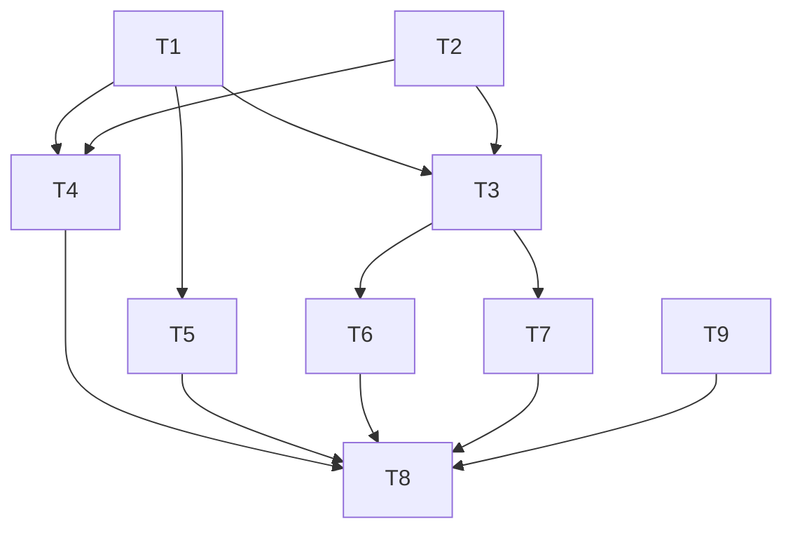

# TASK_ui-home-and-profile

## 任务信息
- 任务名称：ui-home-and-profile
- 创建日期：2026-01-14
- 阶段：Atomize（任务拆分）

## 子任务拆分

### T1 数据模型扩展（隐私标记）
- 输入契约：现有 `TaskItem` 模型、SwiftData 容器。
- 输出契约：新增 `TaskItem.isPrivate: Bool`（默认 false）；数据仍可正常保存与读取。
- 实现约束：不改变模型关系；保持现有排序字段。
- 依赖关系：无前置依赖；后续依赖 T3/T4/T5。

### T2 Face ID 解锁服务封装
- 输入契约：LocalAuthentication 能力可用。
- 输出契约：`PrivacyAuthService`（或等效方法）提供 `requestPrivacyUnlock` 接口。
- 实现约束：失败与不可用需返回 false 并提供提示。
- 依赖关系：无前置依赖；后续依赖 T3/T4。

### T3 主页视觉改版与筛选胶囊
- 输入契约：原 `ContentView` 结构、筛选状态枚举。
- 输出契约：顶部标题区、筛选胶囊（含未完成）、卡片样式更新；保留“进度卡 + 分组卡列表”。
- 实现约束：遵循参考图布局；不改变数据结构与 Live Activity 生命周期。
- 依赖关系：依赖 T1/T2。

### T4 隐私事项展示与操作入口
- 输入契约：TaskRow 现有上下文菜单。
- 输出契约：隐私事项可设置/取消；筛选为“隐私空间/已完成”时正确显示。
- 实现约束：未解锁时隐私事项不可见或显示锁定占位。
- 依赖关系：依赖 T1/T2/T3。

### T5 Live Activity 过滤隐私事项
- 输入契约：ActivityManager 现有同步逻辑。
- 输出契约：Live Activity 内容与进度仅包含非隐私事项。
- 实现约束：不改动生命周期流程；保证数据大小不超限。
- 依赖关系：依赖 T1。

### T6 TabView 与“我的”页面
- 输入契约：App 入口与导航结构。
- 输出契约：TabView 切换“事项/我的”；“我的”页面布局与可点击跳转；支持跳转系统设置、评分弹窗与外链。
- 实现约束：TabView 使用系统组件并自定义外观；无网络与登录。
- 依赖关系：依赖 T3。

### T7 多语言本地化
- 输入契约：界面文本集合。
- 输出契约：`Localizable.strings`（zh-Hans/en）覆盖新增文案。
- 实现约束：不引入第三方库。
- 依赖关系：并行于 T3/T6。

### T9 锁屏实时活动设置
- 输入契约：App Group 可用；Widget 支持读取设置。
- 输出契约：可配置锁屏实时活动显示条数与透明度；Widget 生效。
- 实现约束：设置值需限制范围；不引入第三方库。
- 依赖关系：依赖 T6。

### T8 自检与验收记录
- 输入契约：完成的 UI/逻辑变更。
- 输出契约：`ACCEPTANCE_ui-home-and-profile.md` 更新自检结果。
- 实现约束：至少包含手动验证步骤与截图对比记录点。
- 依赖关系：依赖 T1-T7 完成。

## 任务依赖图（Mermaid）

## 质量门控
- 每个子任务可独立验证并满足验收标准。
- 依赖关系无循环。
- 不引入超出范围的功能或依赖。
